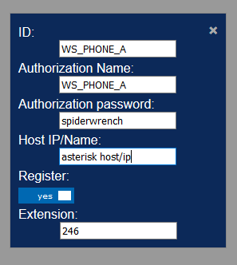

# Глава 20. WebRTC

> _Web, каким я его себе представлял, мы еще не видели. В будущем все еще намного больше, чем прошлом._
>
> -- Тим Бернерс-Ли

## **Браузер как телефон**

В интернет-коммуникации назревает новая революция и, хотя она вряд ли наделает столько шума как революция телекоммуникаций с открытым исходным кодом, она определенно имеет потенциал чтобы тихо заменить сердце каждого текущего коммуникационного приложения.

Сегодня интернет предлагает множество приложений для конференций с закрытым исходным кодом. Все они делают примерно одно и то же, и все же большинство из них требуют установки проприетарного программного обеспечения прежде, чем вы сможете их использовать \(что, конечно, поможет сохранить загрузку в памяти вашего компьютера\). Каждое из них не отличается от последнего приложения конференц-связи, которое вы были вынуждены установить \(для некоторых других встреч, на которых вы присутствовали\). Каждая из этих компаний надеется, что она станет выше других чтобы доминировать в пространстве. Между тем, WebRTC спокойно создает стандарт, который принудительно устраняет все концепции проприетарных мультимеа-коммуникаций, которые, как мы надеемся, устранят некоторые из этих узколобых, огороженных стеной мышления и откроют коммуникации для некоторых фактических инноваций.

С тех самых пор, как существуют веб-браузеры, предпринимались попытки интегрировать мультимедиа в интернет. Это оказалось сложнее, чем ожидалось, так что сегодня телефон по-прежнему является отдельным приложением \(или, конечно, отдельным устройством в целом\).

WebRTC обещает изменить все это.

В этой главе мы познакомим вас с интерпретацией WebRTC, предложенной Asterisk. Ни в коем случае не следует считать это всеобъемлющим введением; все, на что у нас будет время — это провести вас через создание стандартного приложения для видеоконференций, которое, по сути, является приложением “Hello World”, которое все используют для начала работы с WebRTC. Это отличный способ пнуть шины, но важно понимать, что WebRTC будет намного больше.

## **Предварительное знание**

Прежде чем погрузиться в WebRTC, есть некоторые базовые технологии, которые должны объединиться.

Прежде всего: если вы серьезно относитесь к WebRTC — вам понадобится доступ к веб-разработчику, а в идеале к кому-то, кто имеет глубокие знания различных языков, протоколов и технологий, которые делают интернет работающим. WebRTC — это веб-разработка и это технология bleeding-edge, и вы столкнетесь с несовместимостью, проблемами браузера, нераскрытыми ошибками, неполной документацией и другими проблемами, присущими новой технологии. Если вы не являетесь разработчиком полного стека с твердыми сетевыми и Linux навыками, у вас будет очень крутая кривая обучения с WebRTC!

> Вероятно, Цахи Левент-Леви сказал по этому поводу лучше всего:
>
> _WebRTC - это технология, которая является частью VoIP и частью Web. ... Для того, чтобы действительно быть профессиональным разработчиком WebRTC, вы должны быть в состоянии понять две очень разные технические области:_
>
> 1. _Вы должны знать, как работает VoIP. Как движется медиапоток по сети в режиме реального времени \(такие вещи, как RTP, RTCP, Jitter Buffer и множество других сокращений\)._
> 2. _Вам нужно знать и понимать, как разрабатывать для web — frontend и backend \(любой разработчик полного стека?\). JavaScript - это данность. Бонусные очки за node.js._

Итак, да, вы должны быть разработчиком полного стека, плюс гуру VoIP, если хотите комфортно погрузиться в WebRTC. Мы говорим это не для того, чтобы отпугнуть вас, а чтобы заверить, что если вы находите это сложным, то это не связано с каким-либо недостатком с вашей стороны, а просто потому, что это сложный, многослойный материал.

Сказав все это, можно получить вкус WebRTC без всего этого и в этой главе мы собираемся настроить Asterisk для поддержки WebRTC и запустить предварительно построенное веб-приложение, которое продемонстрирует основные аудио/видео возможности реализации Asterisk WebRTC. У вас все еще будет эта крутая кривая обучения, но, надеюсь, мы создали фундамент, на котором можно строить.

## **Конфигурирование Asterisk для WebRTC**

Для передачи вызовов через Asterisk с помощью WebRTC необходимо использовать драйвер канала PJSIP. Конфигурация будет аналогична конфигурации стандартных SIP-телефонов, но не идентична.

Для этого нам понадобится тип транспорта, который мы добавим в файл _/etc/asterisk/pjsip.conf_:

```text
[transport-udp]
type=transport
protocol=udp
bind=0.0.0.0
[transport-tls]
type=transport
protocol=tls
bind=0.0.0.0
cert_file=/home/asterisk/certs/self-signed.crt
priv_key_file=/home/asterisk/certs/self-signed.key
```

Это все для редактирования конфигурационного файла. Для остальных изменений PJSIP мы будем использовать базу данных.[1](https://learning.oreilly.com/library/view/asterisk-the-definitive/9781492031598/ch20.html#idm46178396562296)

Мы создадим двух новых подписчиков с именами `WS_PHONE_A` и `WS_PHONE_B`. Клиент WebRTC будет использовать учетные данные для этих конечных точек для связи с драйвером канала PJSIP в Asterisk \(т.е. для совершения телефонных звонков\).

В таблицу ps\_aors необходимо добавить две записи:

```text
INSERT into asterisk.ps_aors
(id, max_contacts)
values ('WS_PHONE_A', 5),
       ('WS_PHONE_B', 5)
;
```

Необходимы соответствующие записи ps_auth:

```text
INSERT into asterisk.ps_auths
(id, auth_type, password, username)
values ('WS_PHONE_A','userpass','spiderwrench','WS_PHONE_A'),
       ('WS_PHONE_B','userpass','arachnoratchet','WS_PHONE_B')
;
```

Затем мы создадим сами конечные точки:

```text
INSERT INTO asterisk.ps_endpoints
 (id,aors,auth,context,
 transport,dtls_auto_generate_cert,webrtc,disallow,allow)
VALUES
 ('WS_PHONE_A','WS_PHONE_A','WS_PHONE_A','sets',
  'transporttls','yes','yes','all','vp8,opus,ulaw'),
 ('WS_PHONE_B','WS_PHONE_B','WS_PHONE_B','sets',
  'transport-tls','yes','yes','all','vp8,opus,ulaw');
```

В [Главе 4](glava-04.md) мы уже создали наши сертификаты, поэтому должны иметь возможность использовать их здесь.

```text
$ ls -l /home/asterisk/certs/
```

Мы должны позаботиться о конфигурации канала для нашего примера WebRTC.

Теперь нам нужно настроить веб-сервер Asterisk для обработки HTTPS.

```text
$ sudo vim /etc/asterisk/http.conf
[general]
enabled=yes
bindaddr=0.0.0.0
bindport=8088
tlsenable=yes
tlsbindaddr=0.0.0.0:8089
tlscertfile=/home/asterisk/certs/self-signed.crt
tlsprivatekey=/home/asterisk/certs/self-signed.key
```

Сохранимся и перезапустим Asterisk.

```text
$ sudo service asterisk restart
```

Убедитесь, что Asterisk теперь работает не только на HTTP-сервере, но и на HTTPS:

```text
*CLI> http show status
HTTP Server Status:
Server Enabled and Bound to 0.0.0.0:8088
HTTPS Server Enabled and Bound to 0.0.0.0:8089
Enabled URI's:
/ws => Asterisk HTTP WebSocket
```

Ищите в выходных данных `HTTPS`, чтобы проверить работоспособность сертификатов и также должны увидеть /ws, поскольку это указывает на загрузку компонентов WebSockets.

---

Подсказка: если он не работает, всегда проверяйте _/var/log/messages_ для любых сообщений SELinux.

```text
$ sudo grep sealert /var/log/messages
```

---

Брандмауэр в настоящее время не настроен для этих портов, поэтому нам нужно добавить несколько правил для обработки:

```text
$ sudo firewall-cmd --zone=public --add-port=8088/tcp
$ sudo firewall-cmd --zone=public --add-port=8088/tcp --permanent
$ sudo firewall-cmd --zone=public --add-port=8089/tcp
$ sudo firewall-cmd --zone=public --add-port=8089/tcp --permanent
$ sudo firewall-cmd --zone=public --add-port=5061/udp
$ sudo firewall-cmd --zone=public --add-port=5061/udp --permanent
```

На этом этапе вам нужно запустить веб-браузер и установить соединение. Ваш браузер будет жаловаться на соединение, если вы используете самоподписанный сертификат, но он позволит вам осуществить соединение. Это критический шаг, так как вы должны указать вашему браузеру хранить сертификат постоянно, так что WebRTC может использовать соединение WebSocket. Следующий URL-адрес соединит вас:

```text
https://ip-of-asterisk-server:8089/ws
```

Если вы получите сообщение `Upgrade Required` \(о необходимости обновления\), _это хорошо_. Это означает, что соединение хорошее и это просто протокол, говорящий вам, что для этого недостаточно технологии, чтобы это было фактическое соединение WebSocket. Мы там, где должны быть.

Конечно, следующая вещь - фактически испытать сеанс WebRTC через ту среду, которую мы настроили; и для того, чтобы проверить все это, вам нужно будет запустить браузер и загрузить в нем какой-нибудь клиент WebRTC. Следующий раздел будет делать именно это.

## **Cyber Mega Phone**

Для того, чтобы увидеть WebRTC в действии на вашей системе Asterisk вам нужно что-то, что работает в вашем браузере. Самый простой способ увидеть это в действии — взять _Cyber Mega Phone_ от Digium. Это позволит вам быстро настроить рабочий сеанс WebRTC с помощью Asterisk.

Во-первых, так как WebRTC требует использования TLS \(что не является обязательным, как в случае с SIP\), мы собираемся заставить вас еще раз проверить установку ваших сертификатов. Если вы еще не сделали этого, сейчас самое время поработать над [Главой 4](glava-04.md), или есть скрипт, предоставляемый как часть исходного кода Asterisk, генерирующий ключи и сертификаты \(вы найдете его в исходниках Asterisk в каталоге _/home/astmin/src/asterisk-16.&lt;TAB &gt;/contrib/scripts/_. Скрипт называется _as_tls_cert_, и он задокументирован в wiki Asterisk.

Хорошо, теперь нам нужен диалаплан для приема наших звонков WebRTC:

```text
$ vim /etc/asterisk/extensions.conf
exten => 246,1,Noop()
  same => n,Answer()
  same => n,Wait(0.5)
  same => n,StreamEcho(4)
  same => n,Hangup()
```

Сам Cyber Mega Phone находится на GitHub под [аккаунтом Asterisk](https://github.com/asterisk/cyber_mega_phone_2k).

Вы можете загрузить код и запустить его с локального компьютера или же можете загрузить его на веб-сервер и пользоваться им оттуда.

Давайте воспользуемся им с нашего сервера Asterisk:

```text
$ cd /var/lib/asterisk/static-http
$ sudo git clone https://github.com/asterisk/cyber_mega_phone_2k.git
$ sudo chown -R asterisk:asterisk cyber_mega_phone_2k ; sudo chmod 755 cyber_mega_phone_2k
```

Нам понадобится небольшое изменение в конфигурации HTTP-сервера Asterisk, чтобы он мог обслуживать статический контент.

```text
$ sudo vim /etc/asterisk/http.conf
[general]
enabled=yes
bindaddr=0.0.0.0
bindport=8088
tlsenable=yes
tlsbindaddr=0.0.0.0:8089
tlscertfile=/home/asterisk/certs/asterisk.crt
tlsprivatekey=/home/asterisk/certs/asterisk.key
enablestatic=yes
redirect=/cmp2k /static/cyber_mega_phone_2k/index.html
```

Сохраните и перезагрузите http-модуль из консоли Asterisk:

```text
*CLI> module reload http
```

Теперь с помощью браузера можно перейти к новому клиентскому приложению WebRTC:

https://your_asterisk_server:8089/cmp2k

Если все пойдет по плану, вы увидите что-то вроде Рисунка 20-1.


_Рисунок 20-1. Cyber Mega Phone 2K_

Нажмите кнопку Account и введите учетные данные пользователя WebRTC (см. Рисунок 20-2).



_Рисунок 20-2. Данные учетной записи WebRTC_

После ввода сведений, относящихся к системе, нажмите X для сохранения и закрытия.

Теперь вы можете нажать кнопку Connect и, если все прошло хорошо, ваш клиент WebRTC должен зарегистрироваться в Asterisk \(это хорошее время для мониторинга консоли Asterisk, чтобы увидеть, что происходит и есть ли какие-либо ошибки\).

Если вы нажмете кнопку Call сейчас, то должны подключиться через WebRTC и увидеть два окна \([Рисунок 20-3](https://docs.google.com/document/d/13JVG7cvL-x3zXSA95VlHj4nEjCsZiGpuPRZkbjs75cQ/edit#bookmark=id.1fob9te)\). Одно из них — ваше локальное видео, а другое — отображает дальний конец \(т.е. он имитирует другого пользователя, повторяя то, что отправили Вы\). Если Ваше аудио также работает, то вы даже можете получить некоторый шум обратной связи!


_Рисунок 20-3. Приложение Echo с видео_

Вы видите, что есть окно удаленного видео рядом с окном локального видео. Возможно, мы не достигли многого, чтобы хвастаться, но ваша система Asterisk обрабатывает WebRTC, поэтому улыбнитесь и сделайте перерыв. Вы это заслужили.

## **Подробнее об WebRTC**

Экосистема WebRTC быстро развивается и то, что верно на момент написания этой статьи, может быть неверным в ближайшем будущем. Мы нашли следующие ресурсы, которые могут быть очень полезными:

* Цахи Левант-Леви участвует во многих различных инициативах WebRTC, и он щедро делится знаниями о том, как познать WebRTC. Проверьте его сайт bloggeek.me. Подпишитесь на него.
* Группа людей под руководством Kranky Geek выпустила несколько конференций об WebRTC и поделилась многими полезными видео на YouTube. На YouTube-канале [Kranky Geek](http://bit.ly/31DAGVx) вы найдете их.
* Ознакомьтесь с различными протоколами сигнализации, которые популярны в WebRTC: SIP, VIRTO \(из проекта FreeSwitch\), XMPP и даже JSON.
* Посмотрите различные библиотеки сигнализации WebRTC. В настоящее время к популярным относятся: sipML5 \(возможно, самая первая библиотека WebRTC\) и JsSIP \(плюс форк JsSIP с именем _SIP.js_\).
* webrtc.org является официальным домом WebRTC и, безусловно, заслуживает некоторого внимания. Проверьте [домашнюю страницу](https://webrtc.org/start/) перед началом работы.
* Онлайн-платформа обучения о'Рейли имеет несколько видео, которые стоит посмотреть. Для любых книг и видео следите за датой публикации, так как все, что старше года или двух, скорее всего, устарело — WebRTC все еще находится в стадии быстрого развития.

Нам еще так много предстоит узнать, но у нас закончились страницы.

## **Вывод**

WebRTC является захватывающим и важным и, вполне вероятно, что разработчики и интеграторы VoIP должны быть знакомы с этой технологией если хотят сохранить свои навыки актуальными. На момент написания этой статьи WebRTC все еще находится в стадии разработки. Как и в любом исследовании новых границ, те, кто прокладывает путь, должны быть творческими, настойчивыми, оптимистичными и жесткими.

Asterisk может быть полезным компонентом в будущей VoIP-среде, служа, по крайней мере, мостом между продуктами WebRTC следующего поколения и телекоммуникациями старой школы.

[1](https://learning.oreilly.com/library/view/asterisk-the-definitive/9781492031598/ch20.html#idm46178396562296-marker) Обратите внимание, что вы можете настроить драйвер канала PJSIP полностью с помощью файла конфигурации, но в этой книге мы делаем это только там, где это необходимо и, в противном случае, используем базу данных для конфигурации канала PJSIP

[Глава 19. Asterisk REST Interface](glava-19.md) | [Содержание](SUMMARY.md) | [Глава 21. Системный мониторинг и журналирование](glava-21.md)